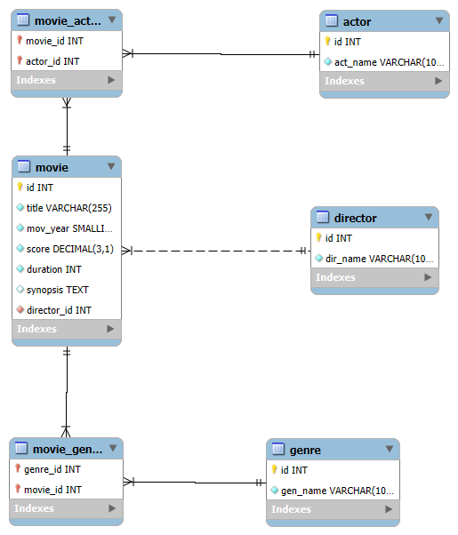

# *🍿 IMDb Top 250 Database 🍿*
## 🤔 DESCRIPCIÓN 🤔
### En esta base de datos vamos a poder mostrar los datos de forma .csv para luego poder ir cargando todo en una base de datos, estaremos usando como motor MySQL. 
### Con este proyecto podremos ver las peliculas mejor valoradas según IMDB. 
### El .csv lo descargamos directamente de la pagina kaggle.com 
# INSTALACION📥
###  1) clonar el repositorio con: .... 
### 2) Cargar el scrpt o archivo sql  en el repositorio de su base de datos de preferencia 
# DIAGRAMA ENTIDAD-RELACION


# EXPLICACION SOBRE COMO FUIMOS ARMANDO LA BASE DE DATOS ✍🏻
Comenzamos creando la base de datos junto con sus tablas de la siguiente manera: 
### 1) tabla director

``` sql
CREATE TABLE director(
id int not null auto_increment primary key,
dir_name varchar(100) not null unique
)CHARACTER SET utf8mb4 COLLATE utf8mb4_unicode_ci;
```

### 2) tabla genero

``` sql
CREATE TABLE genre (
id int not null auto_increment primary key,
gen_name varchar(100) not null unique
)CHARACTER SET utf8mb4 COLLATE utf8mb4_unicode_ci;
```
### 3) tabla actor

``` sql
CREATE TABLE actor (
id int not null auto_increment primary key,
act_name varchar(100) not null unique
)CHARACTER SET utf8mb4 COLLATE utf8mb4_unicode_ci;
```

### 4) tabla peliculas

``` sql
CREATE TABLE  movie(
id int not null auto_increment primary key,
title varchar(255) not null,
mov_year smallint not null,
score decimal(3,1) not null,
duration int not null, 
synopsis text,
director_id int not null,
foreign key(director_id) references director (id),
CONSTRAINT uq_movie_title_year UNIQUE (title, mov_year)
)CHARACTER SET utf8mb4 COLLATE utf8mb4_unicode_ci;
```

## Luego seguimos con sus relaciones 😯

### 1)
``` sql
 CREATE TABLE movie_actor (
movie_id int not null,
foreign key (movie_id) references movie(id),
actor_id int not null,
foreign key (actor_id) references actor(id),
primary key (movie_id, actor_id)
)CHARACTER SET utf8mb4 COLLATE utf8mb4_unicode_ci;
```

### 2)
``` sql
CREATE TABLE movie_genre (
genre_id int not null,
movie_id int not null,
foreign key (genre_id) references genre(id),
foreign key (movie_id) references movie(id),
primary key(movie_id, genre_id)
)CHARACTER SET utf8mb4 COLLATE utf8mb4_unicode_ci;
```

# 🧩 EXPLICACION DE LOS SCRIPTS SQL 
## Este conjunto de sentencias SQL se utiliza para limpiar, normalizar y poblar las tablas del modelo relacional a partir de los datos crudos almacenados en movies_cruda.

### 🎬 1️⃣ Inserción de Directores 

``` sql
INSERT INTO director (dir_name)
SELECT DISTINCT TRIM(director)
FROM movies_cruda;
```

Extrae los nombres de los directores desde movies_cruda.
Elimina duplicados (DISTINCT) y espacios en blanco (TRIM).
Inserta cada director único en la tabla director.

### 🎭 2️⃣ Inserción de Géneros

``` sql
INSERT IGNORE INTO genre (gen_name)
SELECT DISTINCT TRIM(j.g) AS gen_name
FROM movies_cruda r
JOIN JSON_TABLE(
  CONCAT(
    '["',
    REPLACE(
      REGEXP_REPLACE(TRIM(r.genre), '\\s+', ' '),
      ' ',
      '","'
    ),
    '"]'
  ),
  '$[*]' COLUMNS (g.VARCHAR(100) PATH '$')
) AS j
WHERE r.genre IS NOT NULL AND r.genre <> ''
  AND j.g <> '';
```

Descompone los géneros (que pueden venir en una sola celda) usando JSON_TABLE.
Limpia espacios y genera una fila por cada género.
Inserta solo géneros distintos (DISTINCT) en la tabla genre.
El INSERT IGNORE evita duplicados.

### 🎥 3️⃣ Inserción de Películas

``` sql
INSERT INTO movie (title, mov_year, score, duration, synopsis, director_id)
SELECT
  r.name AS title,
  r.year AS mov_year,
  CAST(r.rating AS DECIMAL(3,1)) AS score,
  COALESCE(CAST(REGEXP_SUBSTR(TRIM(r.duration), '[0-9]+(?=h)') AS UNSIGNED), 0) * 60 + COALESCE(CAST(REGEXP_SUBSTR(TRIM(r.duration), '[0-9]+(?=min)') AS UNSIGNED), 0) AS duration,
  r.description AS synopsis,
  d.id AS director_id
FROM movies_cruda r
JOIN director d
  ON d.dir_name COLLATE utf8mb4_unicode_ci = TRIM(r.director) COLLATE utf8mb4_unicode_ci;
  ```

Inserta los datos de cada película, convirtiendo:
rating → número decimal (DECIMAL(3,1)).
duration → minutos totales (sumando horas y minutos).
Asocia cada película a su director mediante director_id.

### 🎞️ 4️⃣ Relación Película ↔ Género

``` sql
INSERT IGNORE INTO movie_genre (movie_id, genre_id)
SELECT
  m.id AS movie_id,
  g.id AS genre_id
FROM movies_cruda r
JOIN movie m
  ON m.title COLLATE utf8mb4_unicode_ci = TRIM(r.name) COLLATE utf8mb4_unicode_ci
 AND m.mov_year = r.year
JOIN JSON_TABLE(
  CONCAT(
    '["',
    REPLACE(REGEXP_REPLACE(TRIM(r.genre), '\\s+', ' '), ' ', '","'),
    '"]'
  ),
  '$[*]' COLUMNS (gname VARCHAR(100) PATH '$')
) jt
JOIN genre g
  ON g.gen_name COLLATE utf8mb4_unicode_ci = jt.gname COLLATE utf8mb4_unicode_ci
WHERE r.genre IS NOT NULL AND r.genre <> '' 
  AND jt.gname <> '';
  ```

Une cada película con todos sus géneros.
Si una película tiene varios géneros, genera una fila por cada combinación.
Usa INSERT IGNORE para evitar duplicados.

### 👥 5️⃣ Creación de Tabla Temporal de Actores

``` sql
DROP TEMPORARY TABLE IF EXISTS _actors_temp;
CREATE TEMPORARY TABLE _actors_temp (
  movie_id INT,
  actor_name VARCHAR(255)
);
```

Crea una tabla temporal que almacenará los pares película - actor.
Se usa como paso intermedio antes de insertar los datos finales.
Mas adelante explicaremos por qué fue necesario este paso.

### 🌟 6️⃣ Poblar la Tabla Temporal

``` sql
INSERT INTO _actors_temp (movie_id, actor_name)
SELECT
  m.id AS movie_id,
  TRIM(j.actor) AS actor_name
FROM movies_cruda c
JOIN movie m
  ON m.title COLLATE utf8mb4_unicode_ci = c.name COLLATE utf8mb4_unicode_ci
 AND m.mov_year = c.year
JOIN JSON_TABLE(
  CONCAT(
    '["',
    REPLACE(REPLACE(TRIM(COALESCE(c.stars,'')), ' # ', '#'), '#', '","'),
    '"]'
  ),
  '$[*]' COLUMNS (actor VARCHAR(255) PATH '$')
) AS j
WHERE TRIM(j.actor) <> '';
```

Extrae los actores del campo stars, que viene separado por #.
Limpia los valores y crea una fila por cada actor con su película correspondiente.

### 🔍 7️⃣ Verificación de la Carga

``` sql
SELECT * FROM _actors_temp ORDER BY movie_id, actor_name LIMIT 20;
SELECT COUNT(*) FROM _actors_temp;
``` 

Permite verificar visualmente que los datos de la tabla temporal se cargaron correctamente y contar la cantidad total de registros.

### 🎬 8️⃣ Inserción Final de Actores y Relaciones

``` sql
INSERT IGNORE INTO actor (act_name)
SELECT DISTINCT actor_name FROM _actors_temp;
INSERT IGNORE INTO movie_actor (movie_id, actor_id)
SELECT t.movie_id, a.id
FROM _actors_temp t
JOIN actor a
  ON TRIM(a.act_name) COLLATE utf8mb4_unicode_ci
   = TRIM(t.actor_name) COLLATE utf8mb4_unicode_ci;
   ```

Inserta todos los actores únicos en la tabla actor.

Crea las relaciones muchos a muchos entre películas y actores en la tabla movie_actor.

# 🚨 ERRORES O PROBLEMAS QUE APARECIERON 🚨

## **Tabla Genre(Género)**
El .csv que descargamos tenia 6 culumnas: name, genre, description, duration, rating, director, stars. Y eso traia ciertas complicaciones consigo, ya que las columnas genre y stars venian con varias campos que eran distintos entre si. Una pelicula en general tiene mas de un genero, por ejemplo, drama, terror, accion, entoces habia que cargar cada palabra de genero como uno distinto y separarlo, dandole un id a cada genero, por eso en el punto de carga de genero se hizo el paso que se muestra mas arriba. Esta sentencia lo que hace es identificarlos, separarlos, evitar duplicados, y luego relacionarlo a 'movie' separando por comas cada id del genero y de esta forma, creando la relacion entre la tabla Genre y Movie. 

## TABLA ACTOR
Continuando con el.csv tenia una columna stars, pero con la compllicacion de que tenia tres actores por peliculas. Los actores que aparecen pueden tener: nombre y apellido; dos nombres y un apellido o un solo nombre. Esto complicaba mucho la carga de esos datos a la tabla, a diferencia de generos, no se podia realizar la carga separando por espacios. La solucion que le encontramos fue separar manualmente cada actor por "#", esto lo hicimos usando VS Code como editor de texto, si habia actores de peliculas que no conociamos lo investigabamos para evitar errores en la carga, de esta forma cuando hicimos la carga de cada actor relacionado a su pelicula correspondiente. 
Lo que se hizo fue crear una tabla temporal que haga la separacion de los actores por # y les asigne un id a cada uno, y luego despues desde esa tabla temporal crear la tabla actor y cargarle esos datos, evitando duplicados y asignando las relaciones a cada pelicula.